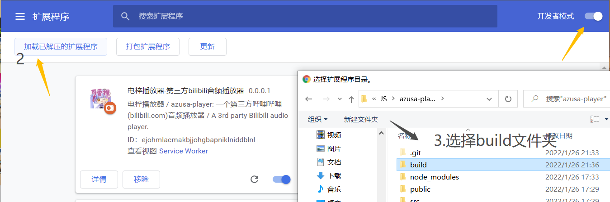

# Azusa Player / 电梓播放器

<p align="center">
  
</p>

<p align="center">
  <a href="./LICENSE"></a>
  <a href="https://github.com/kenmingwang/azusa-player/stargazers"></a>
  <a href="https://github.com/kenmingwang/azusa-player/releases"></a>
  <a href="https://github.com/kenmingwang/azusa-player/actions/workflows/webpack.yml"></a>
</p>

一个第三方 Bilibili 音频播放器（Chrome Extension, MV3）。

## 功能

- 支持通过 `BVID / 收藏夹 ID / 合集链接` 搜索并导入
- 歌单与歌曲管理（增删改查）
- 底部播放器（顺序 / 随机 / 单曲循环）
- 歌词搜索与歌词页面
- Chrome 扩展形态，支持后台播放

## 截图

主页面：


安装教程：



## 安装

- Chrome 商店：
  - <https://chrome.google.com/webstore/detail/%E7%94%B5%E6%A2%93%E6%92%AD%E6%94%BE%E5%99%A8-%E7%AC%AC%E4%B8%89%E6%96%B9bilibili%E9%9F%B3%E9%A2%91%E6%92%AD%E6%94%BE%E5%99%A8/bdplgemfnbaefommicdebhboajognnhj>
- Edge 商店：
  - <https://microsoftedge.microsoft.com/addons/detail/%E7%94%B5%E6%A2%93%E6%92%AD%E6%94%BE%E5%99%A8%E7%AC%AC%E4%B8%89%E6%96%B9bilibili%E9%9F%B3%E9%A2%91%E6%92%AD%E6%94%BE%E5%99%A8/bikfgaolchpolficinadmbmkkohkbkdf>
- 离线安装：
  1. 下载 release 或本地构建产物
  2. 解压后在 Chrome 打开 `扩展程序 -> 开发者模式`
  3. 点击 `加载已解压的扩展程序` 选择 `dist` 目录

## 本地开发

```bash
npm install
npm run dev
```

## 构建与测试

```bash
npm run test:reg
npm run build
```

构建产物目录：`dist/`

## 技术栈

- React + TypeScript + Vite
- Material UI
- react-jinke-music-player
- react-lrc

## License

[MIT](./LICENSE)

## Contact

- Email: `kenmingwang1234@gmail.com`
- Bilibili: <https://space.bilibili.com/1989881>
